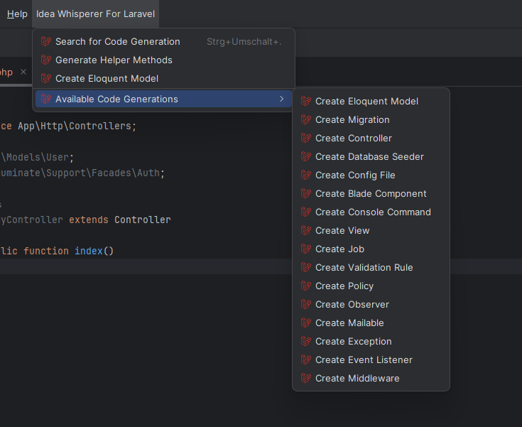
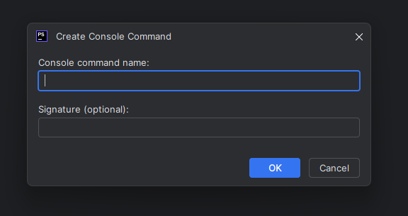
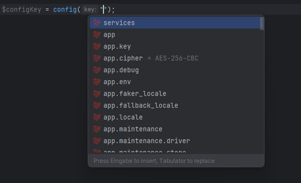

# 

# Idea Whisperer For Laravel

Idea Whisperer For Laravel is a PhpStorm plugin designed to boost your productivity by streamlining the development process for Laravel applications. With a set of powerful features, this plugin helps you work faster when developing Laravel applications in PhpStorm.

## Authors

- [@Alireza-Moh](https://github.com/Alireza-Moh)

## Features

- **Code Generation Helpers**
    - Eloquent Helper Code generations
    - Eloquent Models
    - Migrations
    - Controllers
    - Database Seeders
    - Config Files
    - Blade Components
    - Console Commands
    - Views
    - Jobs
    - Validation Rules
    - Policies
    - Observers
    - Mailables
    - Exceptions
    - Event Listeners
    - Middleware
- **Code Completion and resolving**
    - Form Request Validation Rules
    - Eloquent Table Names
    - Config File References
    - Blade Templates
    - Routing
    - Gates
- **Postfix Templates**
    - A custom postfix template for `dd()` is included, allowing you to quickly wrap an    expression in the `dd()` function for debugging purposes.
- **aravel Version Indicator**
    - A status bar widget that displays the current version of Laravel used in the project.

## Installation

Install my-project with npm

- Open PhpStorm
- Navigate to `File > Settings > Plugins`
- Search for `Whisperer For Laravel`

## Contributing

Contributions are always welcome!

If you encounter any issues, feel free to open an issue on the [GitHub Issues page](https://github.com/Alireza-Moh/idea_whisperer_for_laravel/issues).
If you want to contribute to the project, please do not hesitate :)

## License

This plugin is licensed under the MIT License.

